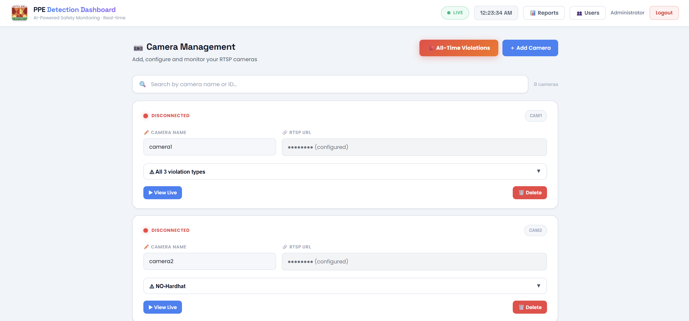
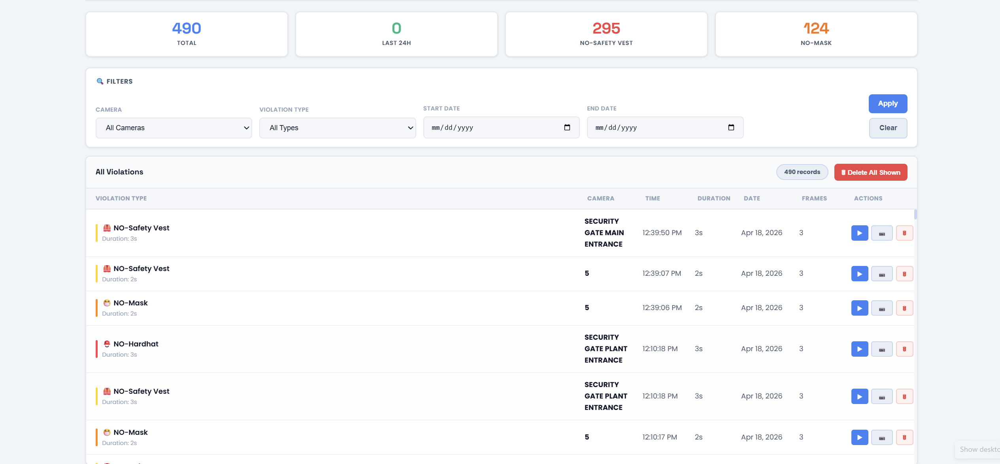
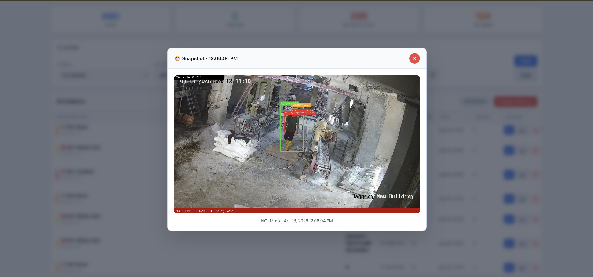

# AI-PPE Detection — Real-Time Industrial Safety Surveillance

> A production-grade, multi-camera PPE compliance monitoring system built for live industrial environments. Detects safety violations in real time using a custom-trained YOLOv8 model, stores evidence, and sends automated alerts — all from a self-hosted Flask dashboard.

---

## Dashboard





---

## What This System Does

Workers in industrial plants are required to wear Personal Protective Equipment (PPE) at all times. Manual supervision is expensive, inconsistent, and impossible at scale. This system replaces that with:

- Continuous AI-powered monitoring across multiple IP cameras simultaneously
- Instant violation detection with annotated snapshot evidence
- Automated email alerts and periodic PDF compliance reports
- A web dashboard for live camera feeds, violation history, and analytics

This was built and deployed in a real industrial facility, running 24/7 across 9 IP cameras.

---

## Architecture

The system is a **4-process pipeline** connected through CSV files and a shared filesystem. Each process is independently restartable — no message broker, no microservice overhead.

```
RTSP Cameras
     │
     ▼
┌─────────────────────────────────────────────────────────┐
│  app.py  ─  Flask server                                │
│  • Holds all RTSP connections (one per camera)          │
│  • Serves /api/frame/<cam_id> to the rest of pipeline   │
│  • Hosts the live dashboard at http://localhost:5000    │
│  • Handles auth, alerts, reports, camera CRUD           │
└────────────────────┬────────────────────────────────────┘
                     │ HTTP /api/frame/<cam_id>
                     ▼
┌─────────────────────────────────────────────────────────┐
│  capture.py  ─  Frame capture                           │
│  • One thread per camera, polls at 1 FPS                │
│  • Saves JPEGs to captured_frames/<cam_id>/<date>/<hr>/ │
│  • Appends row to logs/capture.csv                      │
│  • Auto-cleans frames older than 2 hours                │
└────────────────────┬────────────────────────────────────┘
                     │ logs/capture.csv (tailed)
                     ▼
┌─────────────────────────────────────────────────────────┐
│  detect.py  ─  Batch YOLO inference engine              │
│  • CaptureReader thread tails capture.csv               │
│  • BatchInferenceEngine: every 50ms collects up to 16   │
│    frames across all cameras, runs model() in one call  │
│  • Draws bounding boxes, saves to detected_frames/      │
│  • Appends results to logs/detection.csv                │
│  • Hot-reloads cameras.json every 30s                   │
└────────────────────┬────────────────────────────────────┘
                     │ logs/detection.csv (polled)
                     ▼
┌─────────────────────────────────────────────────────────┐
│  monitor.py  ─  Violation streak detector               │
│  • Polls detection.csv every 5s                         │
│  • Triggers violation when 3+ consecutive frames match  │
│  • Tolerates up to 5-frame gaps (occlusion resistance)  │
│  • Saves best snapshot + stitches MP4 clip via ffmpeg   │
│  • Writes to ppe.db (SQLite)                            │
│  • 2-minute cooldown prevents duplicate alerts          │
└─────────────────────────────────────────────────────────┘
```

**Why this IPC approach:** `capture.py` fetches frames through `app.py`'s HTTP endpoint rather than connecting to RTSP directly. This guarantees exactly one RTSP connection per camera — double-connecting causes most IP cameras to drop both streams.

---

## Tech Stack

| Layer | Technology |
|---|---|
| Object Detection | YOLOv8 (Ultralytics) — custom-trained model (`best.pt`) |
| Inference Engine | PyTorch with CUDA (auto-falls back to CPU) |
| Computer Vision | OpenCV |
| Web Framework | Flask |
| Database | SQLite via Python `sqlite3` |
| Email Alerts | SMTP via Python `smtplib` |
| PDF Reports | ReportLab |
| Charts | Matplotlib |
| IPC | CSV files + shared filesystem |
| Auth | Session-based with bcrypt (werkzeug) |
| Video Assembly | FFmpeg (subprocess call) |

---

## Detected PPE Classes

The custom-trained YOLOv8 model detects **10 classes**:

| ID | Class | Violation When Missing |
|---|---|---|
| 0 | Person | — (anchor class) |
| 1 | Helmet | No helmet |
| 2 | Safety vest | No vest |
| 3 | Gloves | No gloves |
| 4 | Safety boots | No boots |
| 5 | No helmet | Direct violation |
| 6 | No vest | Direct violation |
| 7 | No gloves | Direct violation |
| 8 | No boots | Direct violation |
| 9 | No mask | Direct violation |

Each camera in `cameras.json` can be configured to monitor a subset of these classes.

---

## Features

**Live Monitoring**
- Multi-camera live feed with bounding-box overlays
- Per-camera class filtering (monitor only what's relevant to each zone)
- Real-time violation ticker on the dashboard

**Violation Evidence**
- Annotated JPEG snapshot of the triggering frame
- MP4 clip stitched from the violation sequence
- Timestamped records in SQLite

**Alerts & Reports**
- Automated email alerts with snapshot attachment on each violation
- Scheduled PDF compliance reports (configurable interval, multiple recipients)
- Reports include charts: violations by type, by camera, by time of day

**User Management**
- Role-based access: `admin` (full access) and `user` (assigned cameras only)
- Session authentication with bcrypt password hashing
- Admin can create/edit/delete users and assign cameras

**Camera Management**
- Add, edit, enable/disable cameras via the dashboard UI
- RTSP URL, name, and class configuration per camera
- Changes hot-loaded without restarting the pipeline

**Data Management**
- Violation history with filter, search, and pagination
- `clear_violations.py` — one-command full data reset
- Configurable cleanup: captured frames (2h), detected frames (4h)

---

## Project Structure

```
.
├── app.py                  # Flask server: auth, dashboard, REST API, alerts, PDF reports
├── capture.py              # Per-camera frame capture threads
├── detect.py               # Batch YOLO inference engine
├── monitor.py              # Violation streak detector → DB + videos
│
├── best.pt                 # Custom-trained YOLOv8 weights (not included in repo)
│
├── cameras.json            # Camera registry (RTSP URLs, class config)
├── users.json              # User accounts (bcrypt hashes)
├── email_config.json       # SMTP configuration
├── report_config.json      # PDF report recipients and schedule
├── config.json             # Misc config
│
├── templates/              # Jinja2 HTML templates for the dashboard
│
├── logs/
│   ├── capture.csv         # IPC: capture → detect
│   ├── detection.csv       # IPC: detect → monitor
│   └── *.log               # Per-process log files
│
├── captured_frames/        # Raw JPEGs from cameras (auto-cleaned after 2h)
├── detected_frames/        # Annotated JPEGs with bounding boxes (auto-cleaned after 4h)
├── violation_snapshots/    # Best frame from each violation event
├── violation_videos/       # MP4 clips of violation sequences
│
├── ppe.db                  # SQLite database (violations table)
│
├── clear_violations.py     # Utility: reset all violation data
├── reset_data.py           # Utility: full data wipe
│
├── start_all.bat           # Start all 4 processes
├── stop_all.bat            # Stop all processes
│
└── requirements.txt        # Python dependencies
```

---

## Getting Started

### Prerequisites

- Python 3.9+
- FFmpeg installed and accessible (update path in `monitor.py` line 28 if needed)
- CUDA-capable GPU recommended for real-time multi-camera inference (CPU fallback available)
- IP cameras with RTSP streams

### 1. Clone and Install

```bash
git clone https://github.com/<your-username>/AI-PPE-Detection.git
cd AI-PPE-Detection

python -m venv myvenv
# Windows
myvenv\Scripts\activate
# Linux/macOS
source myvenv/bin/activate

pip install -r requirements.txt
```

### 2. Configure Cameras

Edit `cameras.json` and add your camera entries:

```json
{
  "cam1": {
    "name": "Factory Floor - Zone A",
    "rtsp_url": "rtsp://<user>:<pass>@<ip>/cam/realmonitor?channel=1&subtype=1",
    "enabled": true,
    "classes": [0, 1, 2, 5, 6]
  }
}
```

### 3. Configure Email Alerts (Optional)

Edit `email_config.json`:

```json
{
  "smtp_host": "smtp.gmail.com",
  "smtp_port": 587,
  "smtp_user": "your-email@gmail.com",
  "smtp_password": "your-app-password",
  "from_email": "your-email@gmail.com"
}
```

For Gmail, generate an [App Password](https://support.google.com/accounts/answer/185833) rather than using your account password.

### 4. Add Your Model Weights

Place your trained `best.pt` file in the project root. The model should be trained on the 10-class PPE dataset described above. If you want to use a different class structure, update the class IDs in `cameras.json` and the detection logic in `detect.py`.

### 5. Run the System

**Windows (recommended):**
```bat
start_all.bat
```

**Manual (each in its own terminal, in order):**
```bash
python app.py       # 1. Start Flask dashboard first
python capture.py   # 2. Frame capture
python detect.py    # 3. YOLO inference
python monitor.py   # 4. Violation monitor
```

Dashboard will be available at `http://localhost:5000`.

**Default login:** `admin` / `admin123` — change this immediately after first login.

To stop:
```bat
stop_all.bat
```

---

## Configuration Reference

### Tunable Constants

| Constant | File | Default | Effect |
|---|---|---|---|
| `CONF_THRESHOLD` | `detect.py` | `0.35` | YOLO confidence cutoff — lower = more detections, more false positives |
| `BATCH_SIZE` | `detect.py` | `16` | Frames per GPU inference call |
| `BATCH_INTERVAL` | `detect.py` | `0.05s` | How often the batch engine fires |
| `FPS` | `capture.py` | `1` | Capture rate per camera |
| `FRAMES_THRESHOLD` | `monitor.py` | `3` | Consecutive violation frames before triggering an event |
| `COOLDOWN_MINUTES` | `monitor.py` | `2` | Minimum gap between alerts for the same camera + violation type |
| `GAP_TOLERANCE` | `monitor.py` | `5` | How many non-violation frames are tolerated mid-streak |
| `CLEANUP_HOURS` | `capture.py` | `2` | Captured frames retention |
| `CLEANUP_HOURS` | `detect.py` | `4` | Detected frames retention |

### Timezone

All timestamps use **WIB (UTC+7)** — defined as `INDONESIA_TZ = timezone(timedelta(hours=7))` in each process. Change this constant in `app.py`, `detect.py`, and `monitor.py` to match your deployment region.

---

## How the Batch Inference Engine Works

`detect.py` was designed for maximum GPU utilization across multiple cameras:

1. **`CaptureReader`** thread tails `logs/capture.csv` using a byte-offset cursor. New rows are pushed into per-camera `queue.Queue` objects.

2. **`BatchInferenceEngine`** thread fires every 50ms. It drains up to 16 frames round-robin across all camera queues (one frame per camera per batch to ensure fairness), stacks them into a single tensor, and calls `model(batch)` under a `model_lock`.

3. The lock is held **only** for the forward pass. All post-processing (drawing boxes, saving annotated frames, writing CSV) runs outside the lock in parallel.

4. A **Supervisor** loop in `main()` polls `cameras.json` every 30 seconds and calls `ensure_queue()` for any newly added cameras — no restart needed.

---

## How Violation Streak Detection Works

`monitor.py` tracks each camera independently:

- A **streak** is N consecutive frames (`FRAMES_THRESHOLD=3`) all containing the same violation type
- `GAP_TOLERANCE=5` allows momentary detection gaps (worker turns away, occlusion) without resetting the streak counter
- On streak completion: the best-confidence frame is saved as a snapshot, FFmpeg stitches the frames into an MP4, and a record is written to `ppe.db`
- A `COOLDOWN_MINUTES=2` timer per (camera, violation_type) pair prevents the same ongoing violation from flooding the alert queue

---

## Violation Evidence

Every confirmed violation produces an annotated snapshot and an MP4 clip automatically saved to disk.

### Detection Snapshots

Bounding boxes show the detected class and confidence score. Red boxes = violation, green boxes = compliant.

| | |
|---|---|
|  |  |
|  |  |

### Violation Clip Demo

A short clip is stitched from the violation sequence and saved as an MP4 for audit and review.

https://github.com/user-attachments/assets/violation_demo.mp4

> **Note:** Upload `docs/assets/violation_demo.mp4` as a GitHub release asset or drag-and-drop it into a GitHub issue/PR to get a hosted URL, then replace the link above with that URL. GitHub renders MP4s inline in README when hosted through their CDN.

---

## Roadmap

### In Progress / Planned

**Zero-Shot + YOLO Hybrid Pipeline**

The next major evolution of this system is a two-stage detection pipeline:

```
Stage 1: YOLO (fast, trained)
  → High-confidence detections pass directly through
  → Low/medium-confidence detections escalate to Stage 2

Stage 2: Zero-Shot Vision-Language Model (e.g. CLIP, OWL-ViT, Grounding DINO)
  → No retraining required for new PPE classes
  → Natural language queries: "person not wearing helmet", "missing safety vest"
  → Handles edge cases, novel equipment, unusual angles

Result: YOLO speed for known violations + zero-shot flexibility for anything new
```

This allows the system to be deployed in new industrial environments without retraining the model — just describe what to look for in plain text.

**Other Planned Features**

- [ ] Real-time WebSocket push for dashboard (replace polling)
- [ ] Multi-site support with centralized dashboard
- [ ] REST API for third-party ERP/SCADA integration
- [ ] Worker ID tracking via face recognition (anonymous mode available)
- [ ] Mobile app for on-site security personnel
- [ ] Heatmap visualization of violation hotspots per camera zone
- [ ] Shift-based compliance reporting (morning/afternoon/night)
- [ ] Integration with access control systems (deny zone entry on violation)

---

## Security Notes

- `users.json`, `email_config.json`, and `cameras.json` in this repository contain **placeholder values only** — never commit real credentials
- `.flask_secret` is gitignored and auto-generated on first run
- Change the default `admin` / `admin123` credentials before connecting to any network
- Run behind a reverse proxy (nginx) in production — Flask's built-in server is not production-hardened
- RTSP streams should be on an isolated VLAN; never expose camera IPs to the public internet

---

## Dependencies

```
Flask
opencv-python
ultralytics        # YOLOv8
torch
torchvision
numpy
werkzeug           # password hashing

# Optional — gracefully degraded if not installed:
matplotlib         # charts in PDF reports
reportlab          # PDF generation
```

FFmpeg is required for violation video assembly. Install separately:
- **Windows:** `winget install ffmpeg` or download from https://ffmpeg.org/download.html
- **Ubuntu/Debian:** `sudo apt install ffmpeg`
- Update the hardcoded path in `monitor.py:28` if FFmpeg is not on your system PATH.

---

## License

MIT License — free to use, modify, and deploy. See [LICENSE](LICENSE) for details.

---

## Acknowledgements

- [Ultralytics YOLOv8](https://github.com/ultralytics/ultralytics) — the backbone detection model
- [OpenCV](https://opencv.org) — camera stream handling and image processing
- [ReportLab](https://www.reportlab.com) — PDF report generation
- Deployed and battle-tested at **PT Indo Bharat Rayon**, Indonesia

